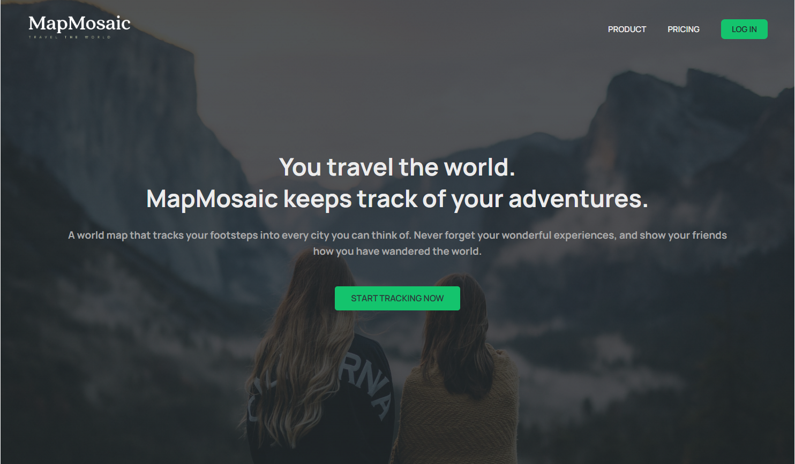
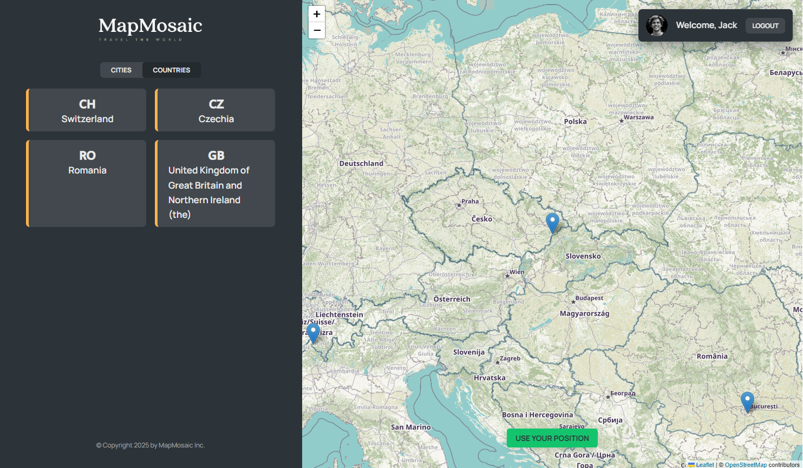

# WorldWise

WorldWise is a React application that provides a dynamic platform for exploring cities, countries, and additional features using React Router for navigation and JSON Server for data handling.

## Features

- **React Router Integration**: Navigate seamlessly between pages and components, including:
  - Homepage
    
  - Product Page
    
  - Pricing Page
    
  - Login Page
  - App layout with nested routes:
    - Cities List
      
    - City Details
      
    - Countries List
      
    - Form Page
      
  - 404 Page for unmatched routes
- **Context API**: State management for city-related data using `CitiesProvider`.
- **Dynamic Routing**: Route parameters for city details.
- **JSON Server**: Simulated backend API with `cities.json`.

## Project Structure

```plaintext
src/
├── components/
│   ├── City.js
│   ├── CityList.js
│   ├── CountryList.js
│   ├── Form.js
├── contexts/
│   ├── CitiesContext.js
├── pages/
│   ├── Homepage.js
│   ├── Product.js
│   ├── Pricing.js
│   ├── Login.js
│   ├── AppLayout.js
│   ├── PageNotFound.js
├── App.js
```

## Getting Started

### Prerequisites

- Node.js (v18 or above recommended)
- npm or yarn

### Installation

1. Clone the repository:

   ```bash
   git clone https://github.com/yourusername/worldwise.git
   cd worldwise
   ```

2. Install dependencies:

```bash
Copy code
npm install
Start the development server:
```

```bash
Copy code
npm run dev
Start the JSON Server:
```

```bash
Copy code
npm run server
Open the application in your browser at http://localhost:5173.
```

## Scripts

- `npm run dev`: Starts the Vite development server.
- `npm run build`: Builds the application for production.
- `npm run preview`: Previews the production build.
- `npm run lint`: Lints the codebase.
- `npm run server`: Starts the JSON Server to serve `cities.json`.

## Dependencies

### Production Dependencies

- `react`: ^19.0.0
- `react-dom`: ^19.0.0
- `react-router-dom`: ^6.28.1
- `leaflet`: ^1.9.4
- `react-leaflet`: ^5.0.0
- `react-datepicker`: ^7.5.0
- `json-server`: ^0.17.3

### Development Dependencies

- `vite`: ^4.4.5
- `eslint`: ^8.57.1
- `@vitejs/plugin-react`: ^4.0.3
- Additional ESLint plugins and type definitions.

## License

This project is licensed under the MIT License.

## Acknowledgments

Special thanks to the contributors and community for their support.

`https://github.com/vibraniumSwaleh/worldwise.git`
